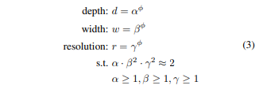
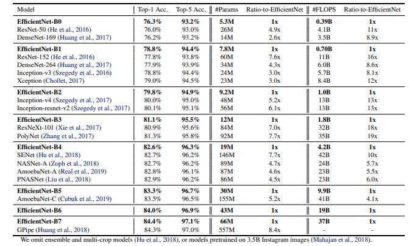

# Efficient Net Paper Study 
[The paper](http://proceedings.mlr.press/v97/tan19a/tan19a.pdf) covers the mathematical expressions and practical results of efficient net. I am writing down my understanding of this paper briefly. 

Usually Scaling up ConvNets helps to achieve better accuracy. There are many ways to scale up a ConvNet. Usually they are:
- Width Scaling 
- Height Scaling
- depth Scaling 
- Resolution Scaling

But if we do scaling for a particular focus point (Ex: Width) we can achieve better result but if we could do a compound scaling where we can take care of all the factors then it would be even better. Again we need a model which can provide better accuracy in better complexity (Time). To achieve this parameter tuning is important to check where we can find our desired result. But parameter tuning in a Large model (Ex: on 4M parameters) is so costly and it's hard to track everything. So, if we can do the tuning is a small model and after getting the desired parameters we can expand the model. So, the goal us to do neural architecture search in a small model and then make it big.

## Compound Scaling 
Different scaling dimensions are not independent. So, we need to coordinate and balance all dimensions of the network (depth, width, resolution) and which is really difficult. But if we can get a reliable compound scaling equation it will be game changing. The paper proposes a Better and new Compound scaling method.

where α, β, γ are constants that can be determined by a small grid search. Intuitively, φ is a user-specified coefficient that controls how many more resources are available for model scaling, while α, β, γ specify how to assign these extra resources to network width, depth, and resolution respectively. Notably, the FLOPS(Floating Point Operations Per Second) of a regular convolution op is proportional to d, w^2, r^2, i.e., doubling network depth will double FLOPS, but doubling network width or resolution will increase FLOPS by four times. Since convolution ops usually dominate the computation cost in ConvNets,scaling a ConvNet with equation 3 will approximately increase total FLOPS by (α · β^2· γ2)^φ. 

EfficientNets has so far 7 versions. the accuracy and complexity chart

