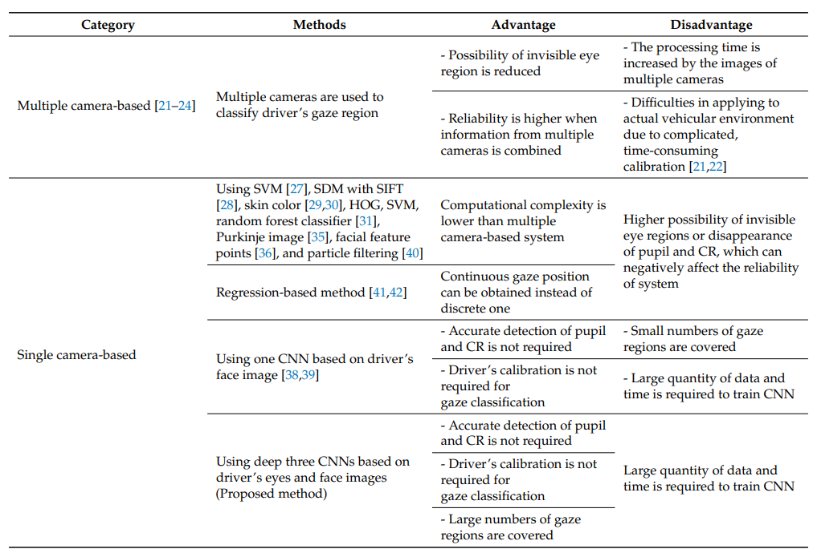
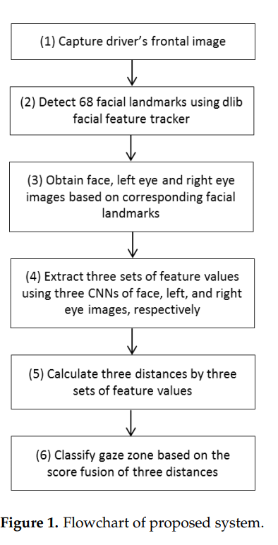
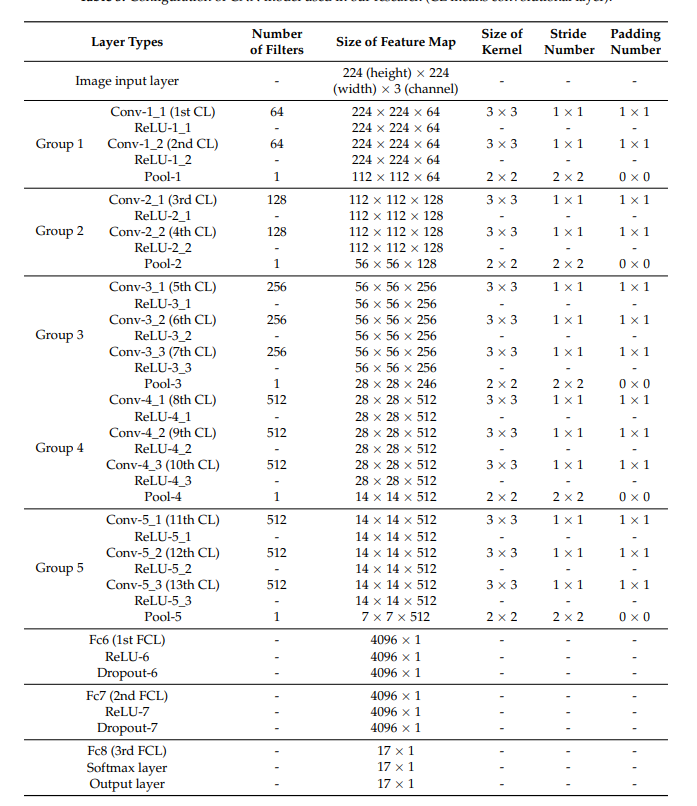
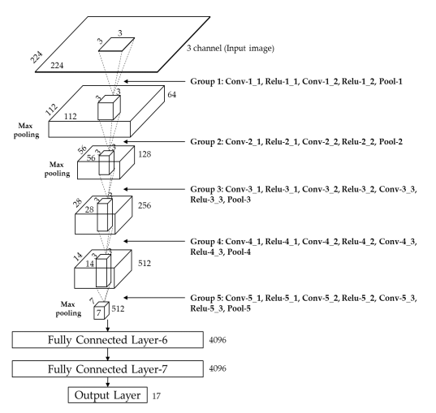

# Deep Learning Based Gaze detection System for Automobile Drivers Using a NIR Camera Sensor

## It's a summary of the paper with my opinions

## Published

## Limitations for existing PCCR Systems
**PCCR**(Pupil Center Corneal Reflection) error increases for environmental issues 
- Light changes
- reflexation on glasses surface 
- motion and optical blurring in captured Eye image
- User calibration required 
- doesn't have any geometrical aspects for lightening, cameras or eyes
## Used Approach: NIR ( Near- Infrared camera sensor)
- considers both head and eye movement
- No user calibration required 

## Apporaches 
- Multiple camera: It's helpful for better estimation but it takes time to process images of multiple camera and it's expensive.
    - Process: tracked facial landmark for 3D images
    - Random forest classifier for zone estimation 
    - Used CLM(constrained local model), POS(pose form an orthography and scaling)

- 2 Hidden camera:
    - used algorithms (SVM, LR)
    - glass and eye makeup can distract the result

## Comparison Between Proposed Gaze ditection algotithm

## Proposed Method for this paper

## Model Configuration

## VGG CNN
