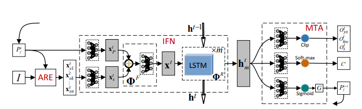

# Learning Fixetion Point Strategy for Object Detection And Classification 

## It's a summery of the paper with my opinion 

## Published 
- 
## The Model Proposed 
Neural Recurrent attentional Structure

## Why this new model Propossed? (What I have understand after reading)
- trivial object detection methods has many problems like they use bounding box over the whole image and use sliding window to find feature in each windows. But in most of the case the whole image has many scilent regions where no features of the image can be found also most of the image contains a backgraound rather then the object. So, the image can be devided in 3 parts 
- Scilent region 
- background of the image 
- the object itself 

So a map of relationship between an object and background can help to make a better object ditection. 

## The Algorithm
Each steps consists of 
- **ARE**: Attentional Representation Extractor
- **IFN**: Information Fusion Network
- **MTA**: Multi-Task Action

## MODEL 
