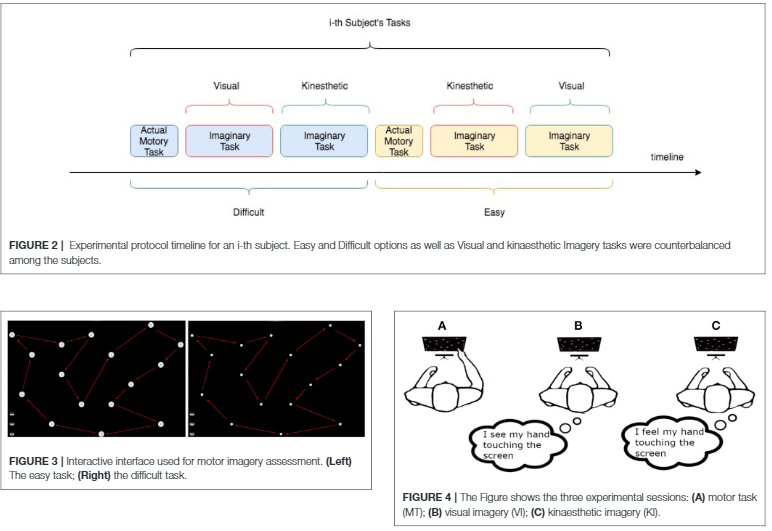
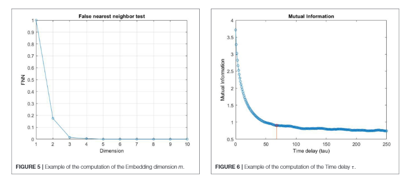
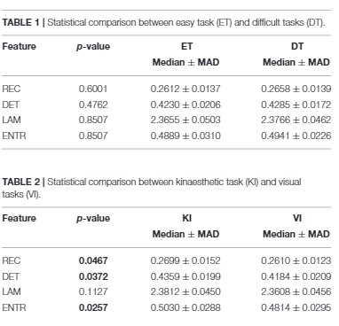

# Nonlinear Analysis of Eye-Tracking Information for Motor Imagery Assessment
## It's a summary of the paper with my opinions

## Published
- Fontires in Neuroscience, 15th January 2020

## MI (Motor Imagery)
is a cognitive process by which an individual reharses a given action. MI can improve motor skills and sport performance. MI ability is measured through
- Self Administered Questionaries
- Mental Chronometry (MC): a measure of temporal depandency between actual and imagined motor tasks which shows Neural Patterns, Comparable Psychological Profiles, similar temporal duration 
- Sensory Modality (kinaesthetic, visual)
- perspective from which imagery task is executed

## Previous Findings 
- Participants use memories of eye movements to help recreating mental images.
- More similar the imagery and perception scan paths the better participants performs in memory tasks 
- Eye movement could be used as markers of spatio-temporal evolution of mental imagery process.
- Eye movement dynamics can provide an easy and rebust indication of quality of cognitive process underlying the motor imagery

## Eye Movement Data Extraction Method
- RQA (Recurrent Quantification Analysis) is effective way to extract information from the eye movement dynamics
## Task For Participants
- Motor Task (MT)
- Visual Imagery Task (VI)
- Kinaesthetic Imagery Task (KI)

## Eye Tracking feature extraction Process
- Point to Point Intantaneous Gaze Ditection (PPIGD)
- Phase Space (PS) & phase space reconstruction
- RQA

## Results
