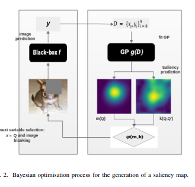
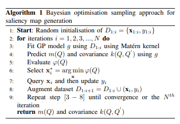
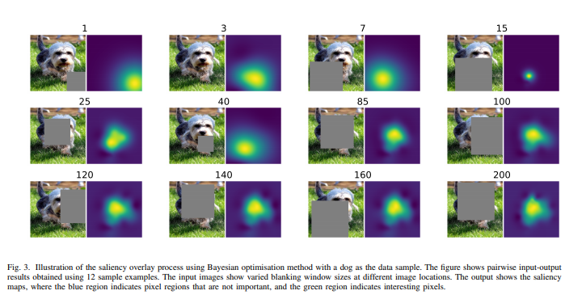
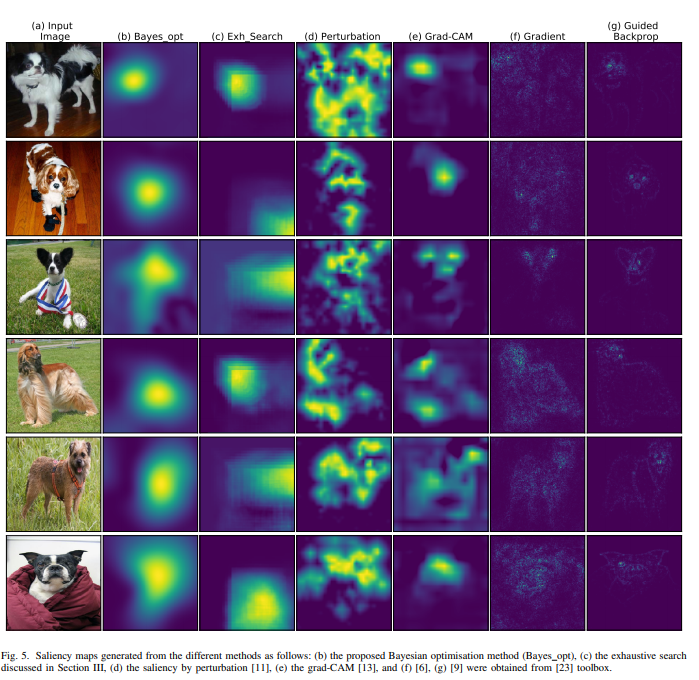
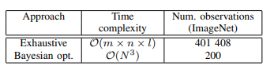

# Black-Box Saliency Map Generation Using Baysian Optimism
## It's a summary of the paper with my opinions

## Published
- 2020

## Saliency MAP
Saliency map is a type of visualization that provides an intutive explaination of the model's output by highlighting the input regions which contributed the most final output. The key motivation behind using saliency maps for CV is to be able to distinguish the image region that contains the informations responsible for the model's prediction. 
- The White-Box method: it's trivial process. It has the basic charecterstics of a model and has access to model parameter and can generate saliency map form that
- The Black-Box Method: This method is proposed in this paper. Here not access on model parameter needed. It uses a **Baysian Optimism** sampling method. The approach aim to find global scilent image region responsible for a particular model prediction.

## Baysian Optimism

## Experiment Results 
- For VGG net pretrained model

## Quality & Interpreterbility

## Time Complexity
