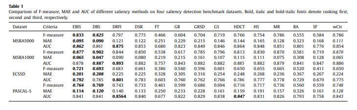

# Exampler Based Image Saliency and Co-Saliency Detection

## It's a summary of the paper with my opinions

## Published
- Science Direct, Nurocomputing, 2020

## Two type of Salient objects are
- Direct Salient object
- Co-Salient object

## To find Salient and co-salient objects trivial methods are
- Huristic Models: Designed Based on features
    - contrasts of featuires
    - light classifier
    - graph propagation
    - reconstruction error
    - simple learning stratagies
    - Hand Crafted features: RGB, LAB, Gabor, texon, LBP
- Deep Learning Based Saliency: Doesn't use hand crafted features. Instead it learns from a model parameter (Called Whitebox method, found in [this paper](https://github.com/FatimaTasnim/Paper-Studies/tree/master/Webcam%20based%20EyeGaze%20Detection/Saliency%20Map/Black-Box%20Saliency%20Map%20Generation%20Using%20Bayesian%20Optimisation))
    - Expensive (time and memory)

## Exampler Based Scliency Model 
- It Combined Huristic and Deep learning models to optimize the complexity and get better result
    - The model: Used two simple SVM classifiers, i.e., two-class SVM and one-class SVM, for saliency and co-saliency evaluations, respectively. For saliency detection. used the regions from the retrieved similar images as positive exemplars and the regions of the image boundaries of the query image as negative exemplars for two-class SVM to identify saliency parts. For co-saliency detection, the regions in each image correspond to the positive exemplars for the one-class SVM to identify common parts.
    - Huristic Part: learns from labeled images to recognize salient regions and robust for the images with complex scenes.
    - Deep Learning Based Part: uses less number of images and can be easier to extend to novel data, such as mural images
## Comparison of different Saliency methods

