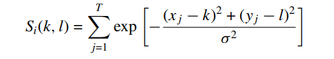

# Visual Attention in Objective Image Quality Assessment: Based on Eye-Tracking Data
## Published
- IEEE Transactions on Circuits and Systems for Video Technology, vol 21, July 2011

## Objective Metrics
Have the aim to autometically quantify the persived image quality. Both dedicated and general metrics can be classified into 
- Full Reference (FR)
    - Similarity between the distorted image and it's original version
    - traditional FR metric: MSR, PSNR(Peak signal to noise ratio)
- Reduced Reference (RR)
    - make use of the features extracted from the original version
- No Reference (NR)
    - attempt to assess the overall quality or some aspect if it without the use of the original 

## Saliency Map
is a representive for visual attention is usually derived from the spatial pattern of fixations in the eye tracking data. to constract this map each fixation point gives rise to a grayscale patch whose activity is Gaussian distributed. The width (σ) of the Gaussian patch approximates the size of the fovea (about 2° of visual angle). 

The eye tracking data used for getting ground truth visual data and made the data independent of reliability of an attention model.

