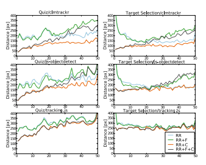

# WebGazer: Scalable Webcam Eye Tracking Using User Interaction

## It's a summary of the paper with my opinions

## Published
- 

WebGazer is a approach to browser-based eyetracking for common webcams.

## Contribution of the work
- the research, development, and evaluation of a real-time browser-based auto-calibrated webcam eye tracker, WebGazer (source code and documentation [publicly](https://webgazer.cs.brown.edu/))
-  investigations of different gaze estimation models enhanced by user interactions.

## Key Components of WebGazer
- Pupil Deterctor
    - detects pupil
    - uses it's location to linearly estimate a gaze coordinate on the screen.
- Gaze Estimator using Regression analysis

## Evaluation Samples
- 76 participents (Online)
    - Description
        - 37 female, 39 male
        - 18-42 years old
        - 39 normal vison, 25 glasses, 18 contact lenses.

- 5 participents (Onsite)
    - Description
        - 3 male, 2 female
        - 4 normal, 1 contact lense
        - 18-30 years old
## Equipmets
- Online
    - Random Devices
- Onsite
    - Desktop PC
    - Monitor: Samsung SyncMaster 2443, 24 inch, (1920*1200)px
    - Webcam: Logitech Full HD C920 USB
    - Distance: 59cm

## Test Cases
1. 40 yes/no question answering
2. clicking 11 dots. distance between dots are around 74px

## Work Inspiration
- Webcam Eye Tracking
    - TurkerGaze(Amazon service)
-  Gaze Cursor Relationship

##  Webgazer Workflow
- Pupil Detection
    - Used Algorithms
        1. clamtracker
        2. JS-object detect
        3. tracking-js
- Eye Features
- Mapping to Self-Callibration 

## Results:
- Online

- Onsite

