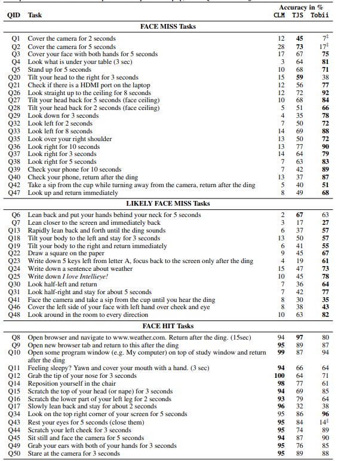
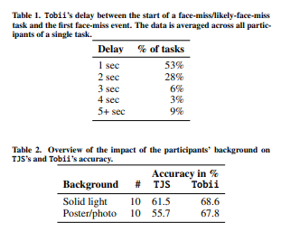

# Webcam-based Attention tracking in Online Learning: A Feasibility Study
## It's a summary of the paper with my opinions

## Published
- IUI 2018

## Online Learning Success Rate
- On average (5-10)%
- Extream case <1%

This can be found by tracking user's focus on the study

## Reasons for this massive failure
- Websites aren't well organized 
- High vedio duration 
- Lack of self regulation
- Lack of interactive sessions (My opinion)

## Existing ways to track user attention 
- Gaze tracking
- EGG data
- computer mouse pressure data
## Additional solution of this paper
- **Face appearance datection**
### Problems of Gaze tracking  
- High Detection Lag (30-60 seconds delays are common)
- Inaccuracy 

### Research Questions of this paper:
- **RQ1**: Which activities—that lead to different face positions in front of the screen—are typical for MOOC learners? Compiled a benchmark suite of fifty typical MOOC learner activities, partitioned into activities that are indicative of (i) focus, (ii) certain loss of focus and (iii) likely loss of focus.
- **RQ2**: How reliable can current software frameworks detect the presence or absence of a face under typical MOOC conditions? Conducted an extensive lab study involving
tracking.js and WebGazer.js as well as a professional eye tracker (our upper bound in terms of performance). A total of twenty study participants execute the benchmark suite of activities in a controlled environment.

## Attention Loss rate according to Video Lecture Length
- length 1 hour: 43% loss
- length 21 mins: 40% loss
## Available JS based Libraries
- webgazer,js
- tracking.js(used in web-gazer)
- clmtracker.js(used in web-gazer)
- CCV.js
- Object Detect(used in web-gazer)
## How WebGazer Works
- it uses face fitting library clmtracker.js
- clm tracks a face and coordinate positions of a face
- clm aggresive facefitting algo and tries to fit face when there is no face
## Tracking.Js
- Used for sicurity system
- it can track eye location but not gaze
- used TJS to check face presence and absence (Face Miss event)

**tracking.js performed better than webgazer.js

## Detecting Face Miss Event
It's an event of user face turning and moving away from computer screen. Used frameworks for this event evaluation is Tobii, CLM, TJS

**Tobbi:** tobii can assure gaze coordinates but cannot determine direction. It's hard to differenticate then the face is turning. can handle 30 samples per second and mostly independent of the computer hardware.

**CLM**: CLM is always prone to detect a face even when there is no face at all. (4 samples in average as it's dependent on computer hardware)
 
 **TJS**: used only face box library to only check if there is a face or not. same sampling as CLM.

 ## User Study
 for user study there is 3 categories of test data. 
 - Face Miss task: results if face or gaze is missing
 - Likely face miss task: reporst a mix if face miss and face hit. Ex: someone might take a note in pen and paper
 - Face hit task: tasks which shouldn't affect the framework. Ex: Chair repositioning

 

## Study modules and Accuracy 

**MY OPINION**: As the background image can affected the result we can take the top & bigger face from detected faces

## github repo of this paper
https://github.com/trx350/xMOOC_benchmark

