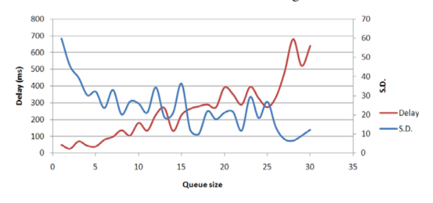

# Webcam Based Eye Gaze Prediction System with Automatic Calibration for Web Browser 

## It's a summary of the paper with my opinions

## Published
- 2019, 16th international conference of ECTI-CON

## Limitations of Existing Eye Gaze Detecting Solutions (Webcam)
- Low Precisions
- In Conveniences (User must perform Calibration every time before using it)

## Research Objectives of the paper:
- Improve accuracy of existing eye perd system
    - Simple Moving Average(SMA)
    - Accuracy rate increased 14.96% 

- Making the system Recalibrate itself to improve accuracy in long term without having to perform Calibration by user
    - Collect the gaze data in first 1 min 
    - Calculate boundary of the screen using gaze data and comparing with real screen boundary to find **ERROR FACTOR**
    - Apply the Error Factor in next move so over time the average test score increases

**So, the solution can fine tune Accuracy and Precision**

## Simple Moving Average(SMA)
- Find average value of a small group of data in the data series
- It makes data smooth 

## Improving Existing Eye Gaze Detectiong System
- Experimenting on WebGazer.JS
- Used SMA on WebGazer.JS 

**My Opinion: the main challenge is selecting Queue_size for SMA**

## Equipments
- Microsoft Surface Laptop
- Screen Size: 13 inches, Resolution: (1426*840) for web display
- 4mpx camera
- BrowserL Google Chrome.

## WebGazer Result Smoothing:
- WebGazer predicts (x,y) coordinates for video frames 
- Save (x, y) in a queue where size_of_queue = expected Time Frame
- Take avg of x & y in that moment 
**My Understanding: some sort of method to find ang on cumulative sum to find the avg in a sudden moment**

## Selecting Queue Size:
queue_size ∝ accuracy
queue_size ∝ Time Delay

## Experiment on Queue Size effect
- Mouse calibration
- Selected time frame(queue_size) for experiment: (1-30)  frames and for each take avg of 5 experiments

**Taken 17 Frames (trade off between Delay & SD**